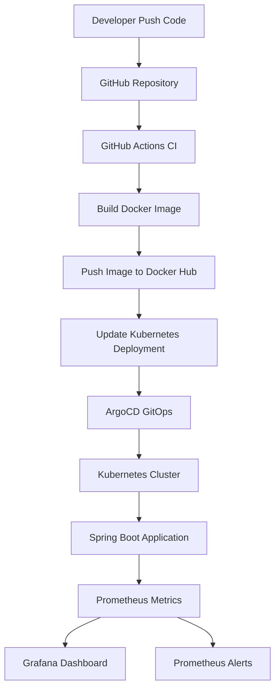
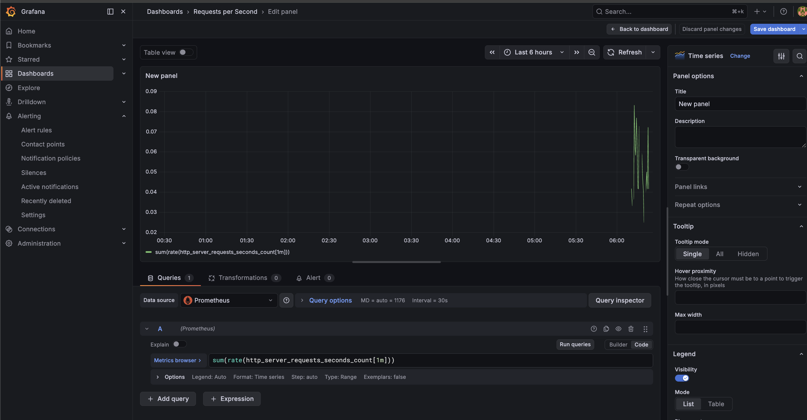

# DevOps GitOps Demo – Spring Boot on Kubernetes
GitOps-based CI/CD pipeline deploying a Spring Boot application to Kubernetes with monitoring and alerting.


This project demonstrates a complete DevOps workflow using:

* Docker
* GitHub Actions
* Kubernetes
* ArgoCD
* Prometheus
* Grafana

The goal is to show how an application can be automatically built, deployed, monitored and alerted.

---

# Architecture



---

# Features

* Automated CI/CD pipeline
* Docker image build and push
* GitOps deployment with ArgoCD
* Kubernetes deployment
* Prometheus monitoring
* Grafana dashboards
* Alert rules for application health

---

# Project Structure

```
new-web
│
├── .github/workflows
│   └── ci.yml
│
├── k8s
│   ├── app
│   │   ├── deployment.yml
│   │   └── service.yml
│   │
│   └── monitoring
│       ├── service-monitor.yaml
│       └── app-alerts.yaml
│
├── src
│
├── Dockerfile
└── README.md
```

---

# CI/CD Pipeline

Developer pushes code to GitHub

GitHub Actions builds Docker image

Image pushed to Docker Hub

Deployment manifest updated

ArgoCD detects change

Kubernetes updates the application

---

# Monitoring

Prometheus collects metrics from:

```
/actuator/prometheus
```

Metrics are discovered using **ServiceMonitor**.

---

# Grafana Dashboard

Example request rate panel:



---

# Example Prometheus Query

```
sum(rate(http_server_requests_seconds_count[1m]))
```

This query shows the **request rate per second**.

---

# Alerts

Example alert rules:

Application Down

```
up{job="new-web-service"} == 0
```

High Error Rate

```
sum(rate(http_server_requests_seconds_count{status!~"2.."}[1m])) > 1
```

---

# Author

Mahmoud Ghanem
